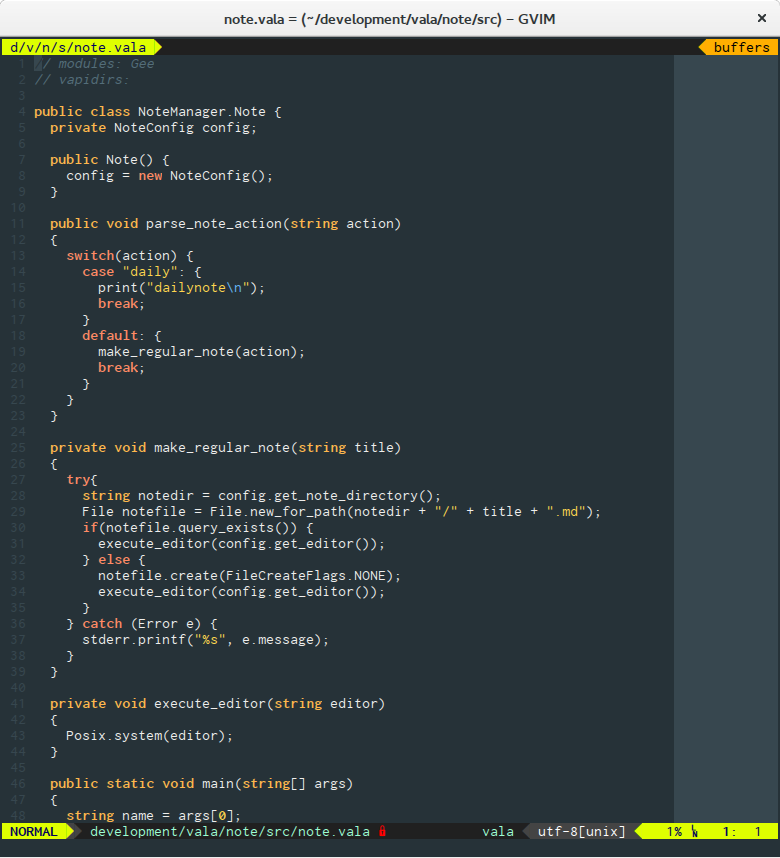

Material Theme for vim
======================

I saw the new material theme for sublime text 3 and quite liked it so i tried
my own attempt to recreate this theme for my favorite editor vim. It is based
on the tango2 theme - its currently not perfect but i try to clean it up
and make it better :)



How to install it
-----------------

If you use Vundle just add in your `.vimrc`

```
Plugin 'Wutzara/vim-materialtheme'
```

or copy it manually in your vim-folder `.vim/`

After that you have to activate it with

```
colorscheme materialtheme
```

